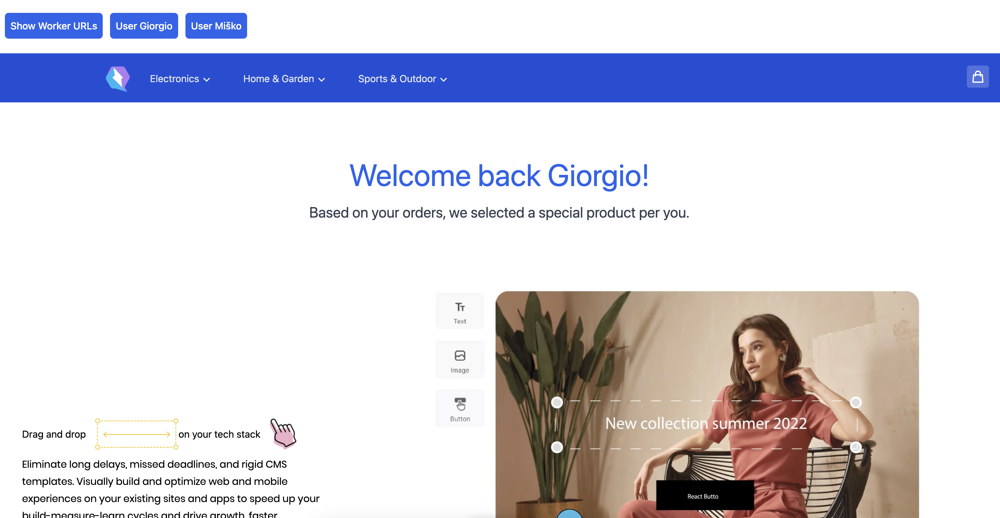

# Microfrontend with Qwik - Qwik dream demo

node v18.10.0 required

## Startup project

From the root install all the dependencies `pnpm install`

## Serve microfrontends

Run `pnpm run preview` to build and serve dist folder for each application.

At http://localhost:5001 you can open the host and see the working application.
